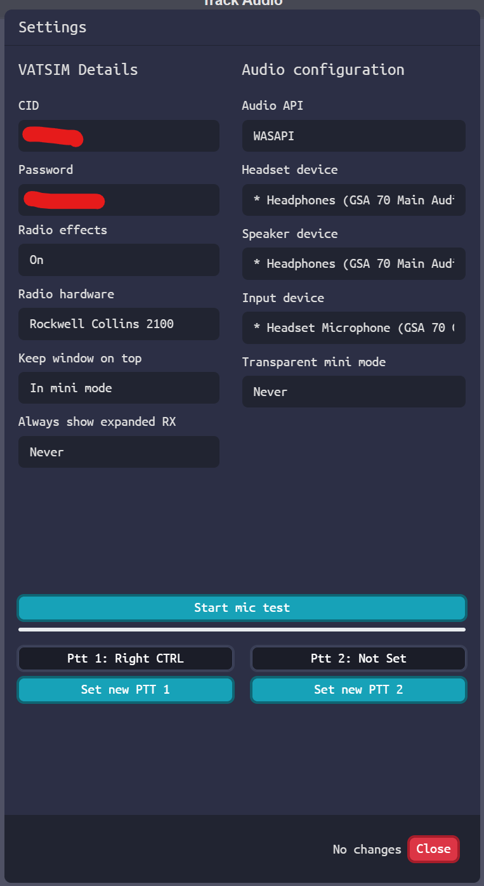

# 3. TrackAudio (Audio Controlling Client)
## 3.1 Track Audio Installation
For controlling over the network, use TrackAudio as the audio client. To download, click [here](https://github.com/pierr3/TrackAudio/releases).

Download the latest version, run the setup file, and configure your audio settings after installation.
### 3.1.1 Track Audio Settings Configuration

1. CID: Your VATSIM CID. 

2. Password: Your VATSIM password. 

3. Radio Effects: Realistic radio effects.

4. Radio Hardware: The equipment you are using to receive and transmit. 

5. Headset Device: Select the headphones or headsets you are using.

6. Speaker Device: Choose the speakers you are using. 

7. Input Device: Set the microphone you are using.

8. Transparent mini mode: Adjust based on your preference. 

9. PTT settings: Test your microphone or configure your Push-to-Talk (PTT) keys.

---