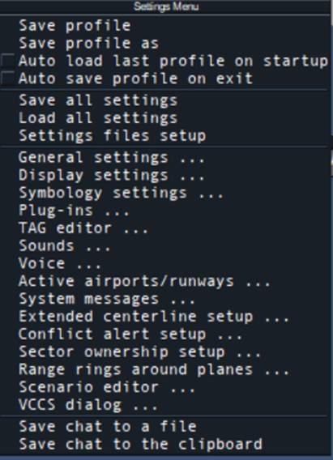
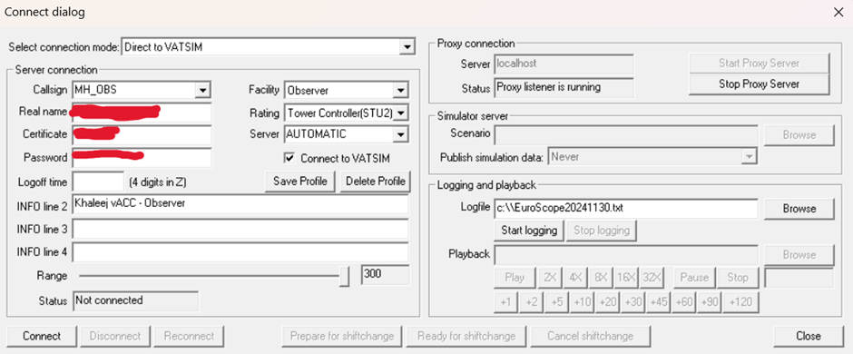
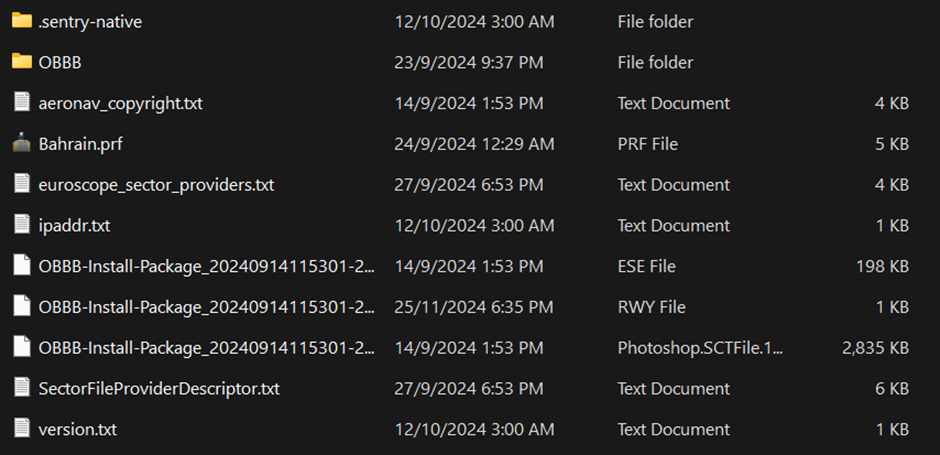
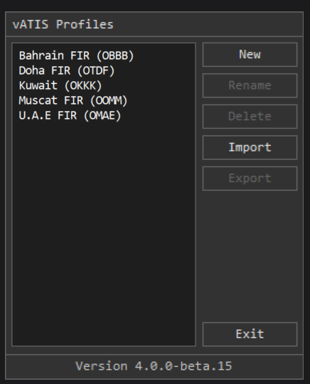
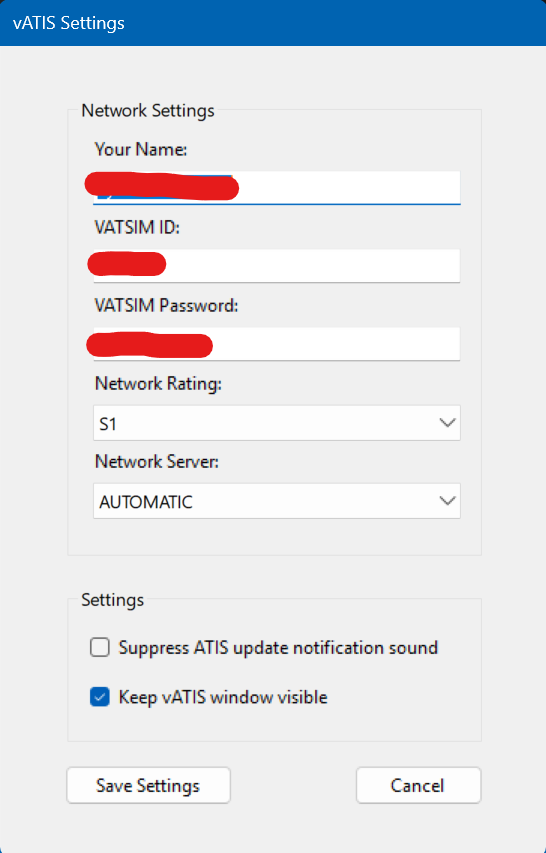
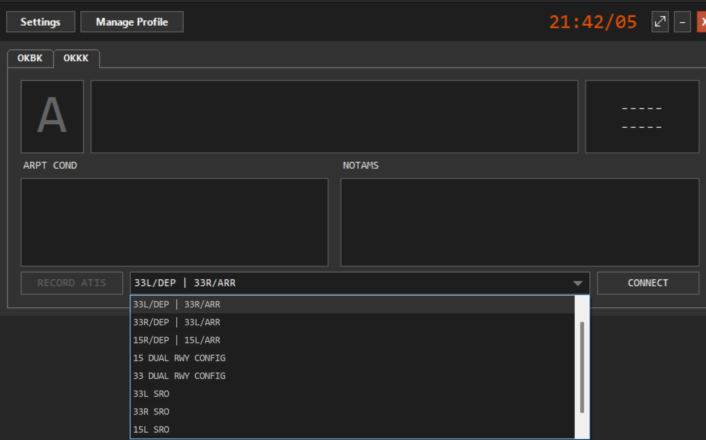

## Guide Details:
This document outlines the first steps to getting all required Softwares in relation to controlling at Khaleej vACC setup.

| **Document Type**   | Controlling Software Installation Guides |
|---------------------|-------------------------------|
| **Revision Date**   | 10 December 2024              |
| **Effective Date**  | 10 December 2024              |
| **Prepared By**     | Mustaeen Hossain              |
| **Approved By**     | Rashid Raikhy                 |
| **Next review due** | 01 May 2025                   |

## Revision Record
|     **Section**    | **Revision** |   **Changes**   | **Prepared/Revised By** | **Approved By** |
|:------------------:|:------------:|:---------------:|:-----------------------:|:---------------:|
| **EuroScope (Controlling Client)** |      1.0     | Initial Release |        Mustaeen Hossain        |  Rashid Raikhy  |
|                    |              |                 |                         |                 |
|                    |              |                 |                         |                 |

## Limitation of Liability
All the following information documented is intended for flight simulation use only. Do not use for real world operations.

# 1. Euroscope (Controlling Client)

## 1.1 Download and Installation of Euroscope

To begin controlling, you will need the EuroScope client. You can download it from [here](https://www.euroscope.hu/wp/).

1. Locate and run the EuroScope setup file, typically named **EuroScopeSetupXX.msi**. It is recommended that EuroScope be installed in the default location suggested during installation.
2. Verify the installation by navigating to **\Program Files (x86)**. 

---

## 1.2 Euroscope Setup
Open Euroscope,

By unchecking these options, you can manually choose which profile to use for any sector file. When closing EuroScope, select Save to All Options when prompted to ensure the changes are saved.

### 1.2.1 Connecting to VATSIM
You can connect to VATSIM by pressing the “connect” button towards the top left of the EuroScope screen. 
Pressing this will trigger a pop-up menu allowing the user to fill out their details.

1. Callsign: Begin by selecting a profile from the dropdown menu of the callsign. Once the sector files are installed, the menu will automatically populate with callsign profiles for the available stations. For instance, if you are connecting as an observer, and your name is Joesph Smith, your observer callsign should be JS_OBS.

2. Real Name: The name displayed to pilots and other controllers upon connection. It must adhere to the VATSIM Code of Conduct A4(b).

3. Certificate: Your unique VATSIM Certificate ID (CID)

4. Password: The password associated with your VATSIM account.

5. Facility: The type of ATC service you will provide. For example, select “Tower” for a tower control position.

6. Logoff Time: An optional field, that allows the user to enter the time, in UTC, when they are planning to log off. This is displayed to pilots and other controllers. 

7. INFO line 2-4: These lines provide position-specific information relevant to the controller, which will get populated automatically once the callsign is selected from the drop-down menu.

8. Range: The controller’s range must comply with VATSIM Code of Conduct C8. The range values are automatically configured for each position.

::::danger Important
It is strongly recommended not to modify the settings for Range.
::::
Right-hand section: The right-hand section of this pop-up window can be disregarded and is only required if the user wants to have more than one instance of EuroScope open.
Once all the required information has been entered, press the Connect button to start controlling.

---

# 2. Sector File Download
## 2.1 Download and Installation of Sector File
Sector files can be downloaded by visiting AeroNav Association - AIRAC Downloads [Aeronav Association - AIRAC Downloads](https://files.aero-nav.com)

Kuwait FIR: OKAC

Bahrain FIR: OBBB

### 2.1.1 Sector File Installation

This section can be followed during the user's installation or any update procedure. Khaleej vACC staff cannot provide technical support when the user has installed an outdated version of the sector file.

1. Extract the update or full installation package to a location. 
2. The folder should now look something like the image below. 

3. EuroScope can now be launched, the user will be prompted to select a profile. The user should navigate to the location where they extracted the sector file and select the most appropriate profile for the position they wish to control, for example, to control Kuwait Ground, “Kuwait Aerodrome” should be selected.

---

# 3. TrackAudio (Audio Controlling Client)
## 3.1 Track Audio Installation
For controlling over the network, use TrackAudio as the audio client. To download, click [here](https://github.com/pierr3/TrackAudio/releases).

Download the latest version, run the setup file, and configure your audio settings after installation.
### 3.1.1 Track Audio Settings Configuration

1. CID: Your VATSIM CID. 

2. Password: Your VATSIM password. 

3. Radio Effects: Realistic radio effects.

4. Radio Hardware: The equipment you are using to receive and transmit. 

5. Headset Device: Select the headphones or headsets you are using.

6. Speaker Device: Choose the speakers you are using. 

7. Input Device: Set the microphone you are using.

8. Transparent mini mode: Adjust based on your preference. 

9. PTT settings: Test your microphone or configure your Push-to-Talk (PTT) keys.

---

# 4. vATIS
## 4.1 vATIS Installation
The ATIS function in EuroScope is disabled in Khaleej vACC sector files. Controllers must use vATIS to provide automatic terminal information services.
Download vATIS [here](https://vatis.app).

---

## 4.2 vATIS Aerodrome Profiles
The first step in a fresh installation is to import the vATIS profile, typically found in the sector file package under the plugins -> vATIS folder.

---

## 4.3 vATIS Settings

1. Your Name: Your name here.
2. VATSIM ID: Your VATSIM CID. 
3. VATSIM Password: Your VATSIM Password. 
4. Network Rating: Your VATSIM Rating. 
5. Network Server: The server you will connect to once you connect your ATIS.

---

# 4.4 Usage

To setup an ATIS for a certain aerodrome follow the steps:
1. Open vATIS.
2. In the vATIS Profiles menu, double-click the desired aerodrome.
3. Choose the appropriate composite and select the correct preset.
4. Adjust the ATIS letter (default is "A") by left- or right-clicking to select the desired letter.
5. Click Connect at the bottom right to activate the ATIS

---

# 5. Video Resource

A video tutorial on downloading the files is available on our official Khaleej vACC YouTube channel.

[Complete Setup Procedure](https://youtu.be/MlV7Lu5gzgk?si=A2yE4kfVNrbNDFgv)

---

# 6. Support

The Khaleej vACC staff are happy to assist members with installing any software mentioned in this guide. However, please note we cannot provide support for issues related to third-party applications, such as vStrips.

For assistance, contact us at support@khaleejvacc.net.
