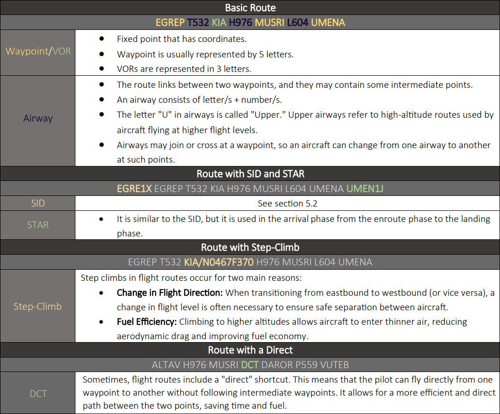

A **flight route** is a designated path taken by an aircraft when traveling between airports. For most **IFR (Instrument Flight Rules)** flights, utilizing a specific route is crucial as it helps controllers track and manage air traffic effectively. These routes aid in maintaining traffic separation and enabling controllers to anticipate the aircraft's intended direction during the flight.

On the other hand, **VFR (Visual Flight Rules)** flights primarily rely on visual scanning and do not necessarily require a predefined route. VFR flights typically navigate using prominent landmarks or visual references such as rivers, towers, lights, and other notable features to determine their course of travel. 

  

 *Table 5.1.1 - Flight Routes* 

In order to prevent conflicts and delays, it is generally not permitted for aircraft to fly over center runways in both directions during VFR circuits (Unless permitted by eAIP). This is because such a configuration can impede the movement and create potential conflicts with aircraft using the other runway. As a result, specific procedures and guidelines are implemented to ensure that VFR circuits are conducted in a manner that maintains safe separation and efficient movement of aircraft at the airport.

