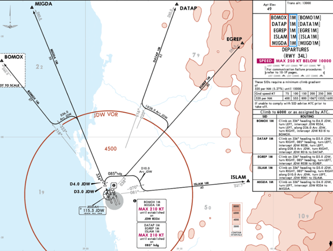
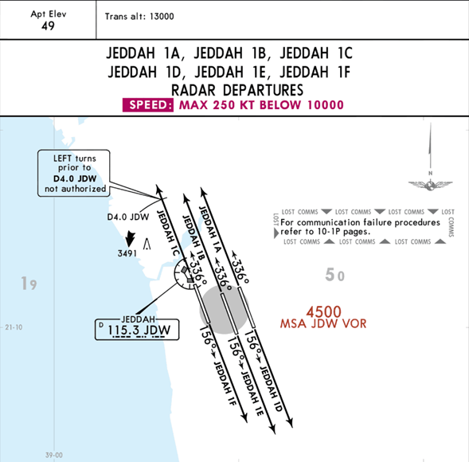

A **Standard Instrument Departure (SID)** is a predefined route that guides IFR flights from the takeoff phase to the enroute phase, specifically to the initial waypoint of the route. 

***SIDs are classified into three types***:
- Area Navigation (RNAV)
- Standard or Non-RNAV
- Radar

Each runway has identifiers for the different types of SIDs, but all runways share the same exit waypoints, which mark the starting waypoint for any departing flight from the airport.

## 6.2.1    Area Navigation (RNAV) SIDs
**Area Navigation (RNAV) SIDs** commonly include multiple speed and altitude restrictions. Controllers typically prefer using **RNAV SIDs** because they provide greater flexibility and opportunities for traffic separation during departures.

RNAV SIDs offer controllers the ability to issue direct instructions to specific waypoints within the SID, and they feature additional speed and altitude restrictions designed to automatically maintain separation between aircraft.

 *Image  6.1.1 - RNAV SIDs (34L)* 

## 6.2.2    Standard SIDs

**Standard SIDs** typically have a lesser number of waypoints, speed restrictions, and altitude restrictions compared to RNAV SIDs.

As a result, standard SIDs are considered less efficient since they require pilots to navigate to fewer waypoints and have fewer restrictions on speed and altitude. 

 *Image 6.1.2 - Standard SIDs (34L)* 

Standard Instrument Departures (SIDs) are often based on navigation aids such as NDBs (Non-Directional Beacons) or VORs (VHF Omnidirectional Range). These aids provide guidance to pilots during departure procedures. 

However, it's important to note that NDBs and VORs are physical ground-based devices that can be subject to factors such as signal interference, equipment malfunctions, or environmental conditions that may affect their accuracy and reliability. Other reason to opt for RNAV SIDs.

## 6.2.3    Radar Departures
**Radar departures** rely on controllers giving pilots specific headings to follow from takeoff until they reach the initial waypoint of their intended flight route. It is generally recommended for controllers to minimize the use of radar vectoring as it adds to their workload and can be distracting. 

As a result, some controllers prefer to use radar departures as a last resort if the pilot is unable to fly an RNAV or Non-RNAV SID.

 *Image 6.1.3 - Radar Departures (OEJN)* 

These departures allow pilots to maintain their heading aligned with the runway until they receive additional instructions from air traffic control (ATC).

::::info Do Note.
Not all airports offer radar departures as shown above. However, in cases where radar departures are necessary, the Delivery controller has the authority to issue clearances for an Omnidirectional departure, which includes a specific heading for aircraft to follow after takeoff (In coordination with the upper controllers). The pilot can also be told to expect radar vectors after departure.