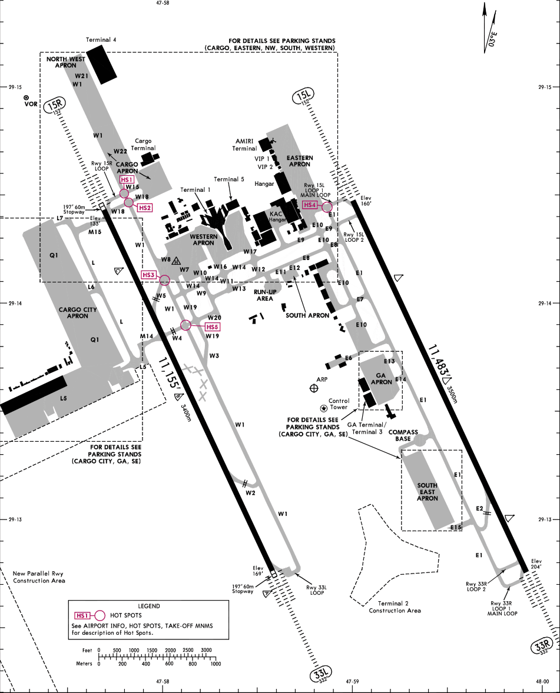

An aerodrome encompasses stands, aprons, taxiways, and runways, forming the infrastructure necessary for aircraft operations. 

Aerodrome charts display the aerodrome map and details as shown below.

 *Image 6.3.1 - Aerodrome Movement Chart (OKKK)* 

::::info Do Note.
While all airports fall under the category of aerodromes, not all aerodromes can be classified as airports. Airports typically have more advanced and comprehensive infrastructure, facilities, and services compared to other types of aerodromes. They are designed to handle commercial air transport operations, including scheduled airline flights, customs and immigration procedures, passenger amenities, and various support services. 

In contrast, other types of aerodromes, such as airfields or airstrips, may have more limited infrastructure and services, often catering to general aviation, private aircraft, or specific purposes such as military operations or emergency services. The distinction lies in the level of development, size, and range of services provided by the aerodrome.