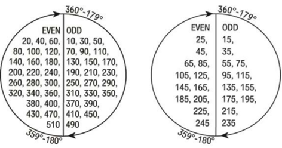
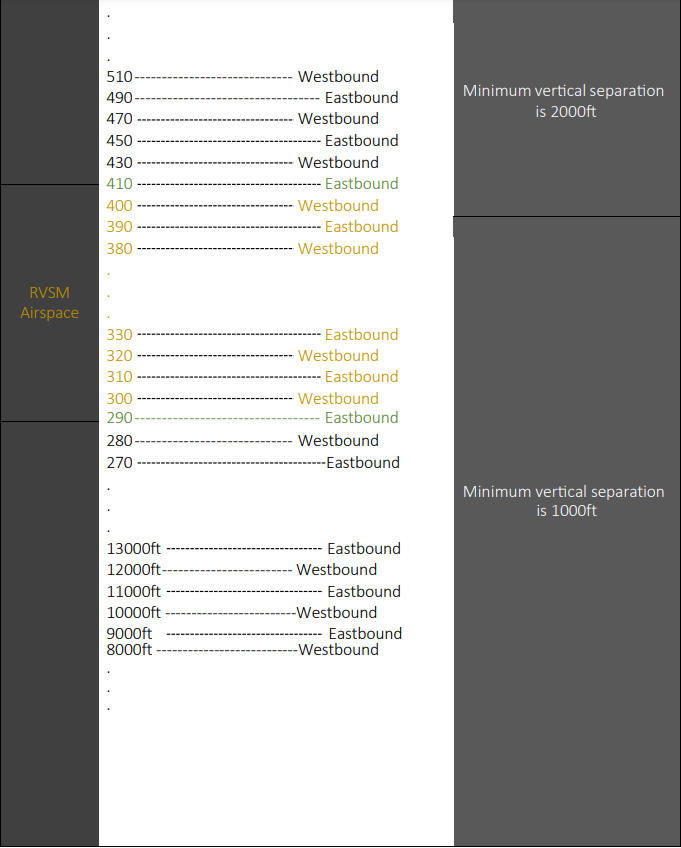

Controllers have the responsibility to ensure that all aircraft under their control are flying at the appropriate flight levels. It is the duty of the subsequent controller to verify the assigned flight level for the specific route segment under their authority. 

Controllers who are responsible for providing flight clearances must ensure that the **Requested Flight Level (RFL)** aligns correctly with the initial segment of the planned flight route.

##  7.1.1 Vertical Separation

All flights operating below FL290 must be separated by a minimum of **1000ft**. While flights operating above FL290 must be separated by a minimum of **2000ft** except within the RVSM airspace.

##  7.1.2 Reduced Vertical Separation Minimum [RVSM]

**RVSM, Reduced Vertical Separation Minimum**, was implemented to reduce the vertical separation above FL290 from **2000ft** minimum to **1000ft** minimum. It allows aircraft to safely fly more optimum profiles, gain fuel savings, and increase airspace capacity.

As a result, flights operating between **FL290** and **FL410** can be separated by a minimum of **1000ft**.

##  7.1.3 Eastbound and Westbound

Flights under FL410 should follow specific flight levels range based on the flight direction:

- Eastbound flights.

- Westbound flights.

Eastbound flights must be at **ODD** levels (11000ft, FL210, FL330, FL410, …).

While westbound flights must be at **EVEN** levels (12000ft, FL220, FL300, FL380, …).

This rule must not applied above FL410 because all flights will be separated by minimum of 2000ft. As a result, all the valid levels above FL410 will be **ODD**.

 *Image 7.3.1 - Semi Circular Rule* 

 *Image 7.3.2 - RVSM* 

##  7.1.4 VFR Departures

For VFR (Visual Flight Rules) flights, it is required to maintain altitudes that are in increments of 500 feet, such as 8500 feet, 9500 feet, 11500 feet, and so on. VFR flights need to adhere to specific altitude levels based on their direction of travel, with westbound flights maintaining altitudes in the thousands digit and eastbound flights doing the same.

The maximum altitude for VFR flights in Bahrain and Kuwait is **12500ft**.

##  7.1.5 VFR Circuits

Controllers can calculate the VFR circuit altitudes for Khaleej Aerodromes using the following formula:

**VFR Circuit Altitude = Airport Elevation + 1500ft**

The result should be rounded to the nearest 5 hundred.