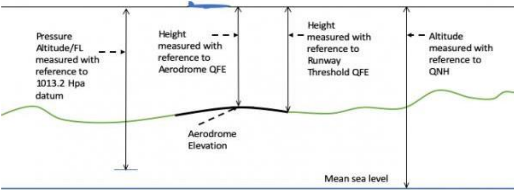

**METAR**, which stands for Meteorological Terminal Air Report, is a standard report that provides meteorological information specific to an aerodrome. It can also be referred to simply as a routine aerodrome meteorological report. 

##  8.2.1 What is Included in a METAR
The METAR report follows a prescribed format and includes various elements, typically presented in a specific order as listed below:
- **Location (ICAO for the Airport)**
- **Date and Time of the METAR report**
- **Surface winds**
- **Visibility**
- **Weather**
- **Clouds**
- **Temperature and Dewpoint**
- **Altimeter Pressure**
- **Trend**

### 8.2.1.1 **Location (ICAO for the Airport)**
The ICAO indicator of the reporting station. For example, OEJN.

### 8.2.1.2 **Date and Time of the METAR report**
The day of the month and the time of the observation in hours and minutes in UTC/ Zulu

| **231000Z** | The METAR was recorded on the 23rd of the current month, at 10:00 Zulu. |
|:-------:|:-----------------------------------------------------------------------:|
|**191330Z** | The METAR was recorded on the 19th of the current month, at 13:30 Zulu. |

### 8.2.1.3 **Surface winds**

|   **36010KT**  |                  Wind 360 degrees at 10 knots                  |
|:--------------:|:--------------------------------------------------------------:|
|   **VRB05KT**  |                    Wind variable at 5 knots                    |
|   **00000KT**  |                           Wind calm.                           |
| **25018G30KT** | Wind 250 degrees at 18 knots gusting to a maximum of 30 knots. |

### 8.2.1.4 **Visibility**

| **0500** |               Visibility is up to 500 meters.              |
|:--------:|:----------------------------------------------------------:|
| **7000** |         Visibility is up to 7000 meters (or 7 Km).         |
| **9999** | Visibility is up to 10,000 meters or more (10 km or more). |
| **8888** |   Visibility is up to 8000 meters or more (8 km or more).  |
| **0000** |             Visibility is less than 50 meters.             |

### 8.2.1.5 **Weather**
Weather is indicated by up to 3 groups comprising symbols and letters from the following:

|  **+** |      Heavy      | **DZ** |    Drizzle   | **IC** | Ice Crystals | **SN** |            Snow            |
|:------:|:---------------:|:------:|:------------:|:------:|:------------:|:------:|:--------------------------:|
|  **-** |      Slight     | **FG** |      Fog     | **MI** |    Shallow   | **SQ** |           Squall           |
| **BC** |     Patches     | **FC** | Funnel Cloud | **PL** |  Ice Pellets | **SS** |          Sandstorm         |
| **BL** |     Blowing     | **FU** |     Smoke    | **PO** |  Dust Devils | **TS** |        Thunderstorm        |
| **BR** |       Mist      | **FZ** |   Freezing   | **RA** |     Rain     | **VA** |          Volcanic          |
| **DR** |   Low Drifting  | **GR** |     Hail     | **SA** |     Sand     | **VC** |       In the vicinity      |
| **DS** |    Dust Storm   | **GS** |  Small Hail  | **SG** |  Snow Grains | **UP** | Unidentified Precipitation |
| **DU** | Widespread Dust | **HZ** |     Haze     | **SH** |    Shower    | **RE** |           Recent           |

***Examples of compromising symbols***

|   **+SN**  |      Heavy Snow.      |
|:----------:|:---------------------:|
| **SHRASN** | Shower Rain and Snow. |

- **Clouds**
Cloud amount is reported by specific symbols followed by the height of the cloud in hundreds of feet. 

***These symbols are:***

- **SKC (Sky Clear)** = 0/8
- **FEW (Few)** = 1-2/8
- **SCT (Scattered)** = 3-4/8
- **BKN (Broken)** = 5-7/8
- **OVC (Overcasted)** = 8/8

***Examples of a full cloud report***

FEW015 = few clouds at 1500ft, SCT030 = Scattered cloud at 3000ft

***Other symbols***

|        **CB or TCU**        |                         Significant convective cloud                         |
|:---------------------------:|:----------------------------------------------------------------------------:|
| **VV+ vertical visibility** | When the sky is obscured, Vertical Visibility can be shown by VV[Visibility] |
|           **NSC**           |                             No Significant Cloud                             |

### 8.2.1.6 **CAVOK**

When certain conditions occur simultaneously, the term CAVOK (cloud and visibility OK) is used to replace the Visibility, Cloud, and Weather groups in a METAR report.

**These conditions are as follows:**
 - Visibility is 10 kilometers or more.
 - There are no **Cumulonimbus (CB)** or **Towering Cumulus (TCU)** clouds present.
 - There are no clouds below **5000 feet** above ground level or the Minimum Sector Altitude (MSA), whichever is higher.
 - There is no significant weather affecting the aerodrome or its vicinity.

 When these conditions are met, the CAVOK indicator signifies that visibility, cloud cover, and weather conditions are favorable for flight operations.

### 8.2.1.7 **Temperature and Dewpoint**

The air temperature and dewpoint in a METAR report are provided in whole degrees **Celsius**. For instance, a notation such as 25/05 indicates that the air temperature is 25°C and the dewpoint is 5°C. In some cases, the letter **"M"** may precede the temperature or dewpoint value, indicating a negative or minus value. 

For example, M05 would represent a temperature or dewpoint of -5°C. This notation is used to indicate temperatures below freezing or in the negative range.

### 8.2.1.8 **Altimeter Pressure**

Aircraft pressure altimeters are instruments that display the aircraft's elevation relative to a specific reference point. The choice of reference point depends on the barometric pressure set on the altimeter sub-scale. The standard unit of measurement for barometric pressure is the **hectopascal (hPa)**.

**There are three sub-scales on the altimeter:**
- **QNH:** This is the pressure set on the altimeter sub-scale to indicate the aircraft's height above sea level.

- **QFE:** This is the pressure set on the altimeter sub-scale to indicate the aircraft's height above a designated reference elevation.

- **Standard Pressure:** This is the standard pressure of 1013.2 hPa, which is used by aircraft operating above the transition level. It is used to determine pressure altitude (also known as Flight Level) and provides a common reference for vertical measurements.

These altimeter sub-scales enable pilots to accurately determine their aircraft's altitude relative to the chosen reference point.

::::info For your information!
If the QNH is less than 1000, controllers need to mention the unit, **hectopascal (hPa)**.
::::
### 8.2.1.9 **Trend**

Trend forecasts are indicated by **BECMG** (Becoming) or **TEMPO** (temporary) which may be followed by a time group (hours and minutes UTC/Zulu) preceded by one of the letters indicated **FM** (from), **TL** (until), **AT** (at). For example, **BECMG FM1030 TL1130.**

**NOSIG** replaces the trend group when **no significant changes** are forecast to occur during the 2-hour forecast period.

### 8.2.1.10 Examples of METARs

|         **OEJN 231830Z 31011KT CAVOK 35/15 Q1001 NOSIG**         |
|:----------------------------------------------------------------:|
|   Jeddah METAR was recorded on the 23rd of the current month at 1830 Zulu. Surface wind 310 degrees, at 11 knots. Cloud and visibility OK. Temperature 35°C and dewpoint 15°C. QNH 1001. No significant changes.|
|     **OEDF 171000Z 30019KT 6000 BLDU NSC 45/02 Q0999 NOSIG**     |
|Dammam METAR was recorded on the 17th of the current month at 1000 Zulu. Surface wind 300 degrees, at 19 knots. Visibility 6KM. Blowing widespread dust. No significant cloud. Temperature 45°C and dewpoint 02°C QNH 999 hectopascal. No significant changes.                                                                  |
| **OERK 231400Z 33017G27 1000 BLSA VV010 42/00 Q1004 TEMPO 0500** |
| Dammam METAR was recorded on the 17th of the current month at 1000 Zulu. Surface wind 300 degrees, at 19 knots. Visibility 6KM. Blowing widespread dust. No significant cloud. Temperature 45°C and dewpoint 02°C. QNH 999 hectopascal. No significant changes.                                                                 |