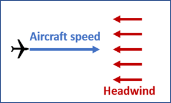
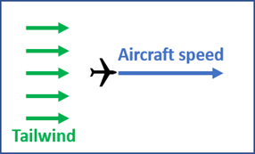
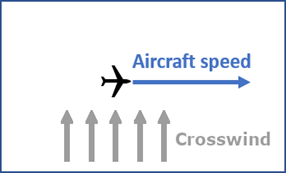
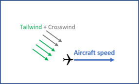

Runways should be exclusively utilized for takeoff and landing in a single direction, primarily determined by the wind's direction.

##  8.4.1   Runways and wind heading
***Runway Designator***

The runway designator is denoted by a two-digit number that approximates the magnetic North when viewed from the approach direction. For instance, if the centerline azimuth is **343**, the runway designator would be **34**.

***Parallel Runways***

In the case of parallel runways, an additional letter is added to the number to indicate their relative position. The letters **"L" (left), "R" (right), and "C" (center)** define the orientation of each parallel runway from the viewpoint of an observer standing at the threshold.

***Wind direction and speed***

Wind direction is commonly communicated using a three-digit number, rounded to the nearest 10° true, representing the direction from which the wind blows. This information is typically provided in written forecasts, Automatic Terminal Information Service (ATIS), or weather broadcasts. Following the wind direction, the wind speed is specified in kilometers per hour or knots (NM/hour). For example, a wind blowing from a direction of **273°** true with a speed of 18 knots would be reported as 27018KT.

As shown above, the wind direction is represented by arrows indicating the direction of the wind flow. In the left scenario, the wind is indicated as **030XXKT**, meaning it is coming from 030° with "XX" denoting the wind speed in knots. In the right scenario, the wind is stated as **210XXKT**, indicating a wind direction from **210°**.

It is important to remember that the runway heading is opposite to the wind direction. When standing in the middle of the runway and facing the runway heading, the wind would be blowing from the opposite direction. For example, if the runway heading is **180°**, the wind from **030°** would be a headwind, and the wind from **210°** would be a tailwind when considering takeoff or landing along that runway.

##  8.4.2   Wind versus take off and landing movement

Prior to takeoff and landing, pilots carefully consider the wind conditions as a crucial factor. It is preferable for aircraft to operate in conditions where they can take off and land into the wind, known as headwinds. This approach helps reduce the necessary speeds for becoming airborne during takeoff and for safely coming to a stop after landing.

***Minimum take-off and landing speed***

All aircraft strive to take off against the wind due to the principles of reaction and aerodynamics. When taking off into headwinds, the force exerted on the wings generates an upward thrust, enabling the aircraft to achieve liftoff at a reduced speed. The same principle applies during landing, where headwinds allow the aircraft to land at lower speeds by utilizing the upward thrust caused by the winds.

***Winds with respect to the aircraft’s direction***

- **Headwind**

When the wind opposes the aircraft's direction of movement, it is referred to as a headwind.

- **Tailwind**

When the wind blows in the same direction as the aircraft's movement, it is referred to as a tailwind.

- **Crosswind**

When the wind blows perpendicular to the aircraft's direction of movement, it is referred to as a crosswind.

  
 